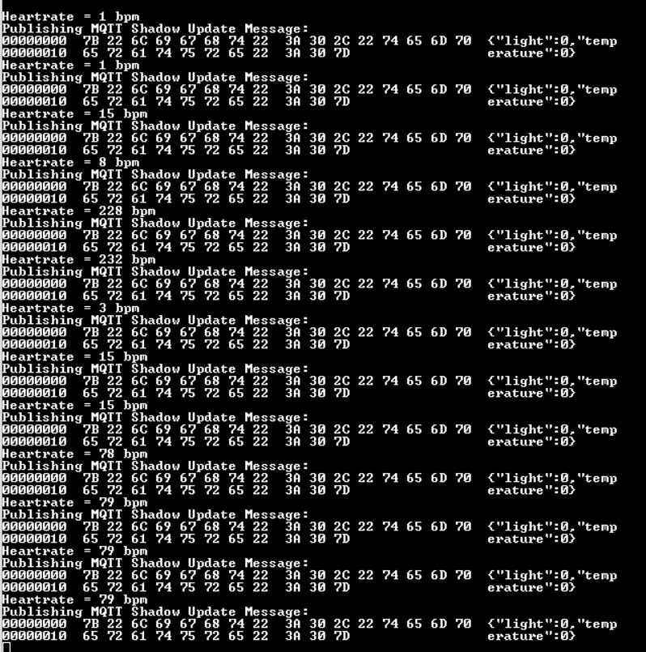

# CryptoAuth Trust Board + WIFI 7 Click Board + Heart Rate 9 Click Azure IOT Connectivity Demo.

**Introduction**

This demo is an Initial version of the Azure IOT Connectivity demo with Trust Board. This demo is on top of the 
existing [TPDS](https://www.microchip.com/en-us/product/SW-TPDSV2) solution. 

## Pre-Requesites

User needs to follow the latest [TPDS](https://www.microchip.com/en-us/product/SW-TPDSV2) solution and test the Azure IOT Trust FLEX Use case.
Tbe above operation would ensure the Demo board is now provisoned with customer's Azure account and would generate the azure credentials header file 
azure_connect.h

## Hardware setup

The below are the list of hardware kits needed for this demo.

  1. [Crypto Authentication Board](https://www.microchip.com/en-us/development-tool/DM320118)  based on SAMD21E18 MCU and ECC608 TrusFLEX.
  2. Mikro Electronika [WiFi 7 Click board](https://www.mikroe.com/wifi-7-click) based on WINC1500 module.
  3. [Heart Rate 9 Click](https://www.mikroe.com/heart-rate-9-click)

**Setting the hardware**

The TPDS hardware supports only one click board connector and to place the heart rate click board, we need to expand the WIFI7 click board, so that
the Heart rate click can be connected.

Please refer below images with respect to setting up the hardware.

Step1:

 

Step 2:

  

Step 3:

  

**Setting up/Modifying the project configuration changes**

  - Set Project Configuration to point to AZURE specific project.
  - Replace azure_connect.h with your azure credentials.
  - Need to provide the Wifi credentials in project before proceeding to program the application and
build it once again. The Wifi credentials can be changed in file **cloud\_wifi\_config.h** _ in path _{ProjLoc}\firmware\src\common_

**Running the demo**

Flashing the modified project using MPLAB IDE should provide the below initial display in teraterm with configuration 1152008N1 configuration.

This  indicates that the device is able to talk to the cloud.

The Heart rate value will be incorrect for initial 1-2 readings or if the finger is not placed correctly, see the last few 
data are correct after placing the finger correctly.

# Version History

| Date    | Description                                                |
|-----------|------------------------------------------------------------|
| 01/06/23      | Initial Version                   |

